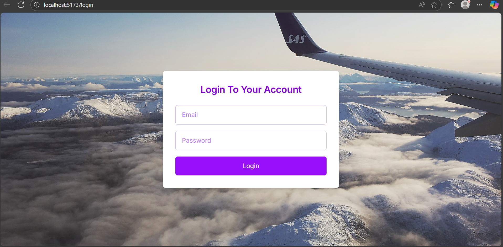
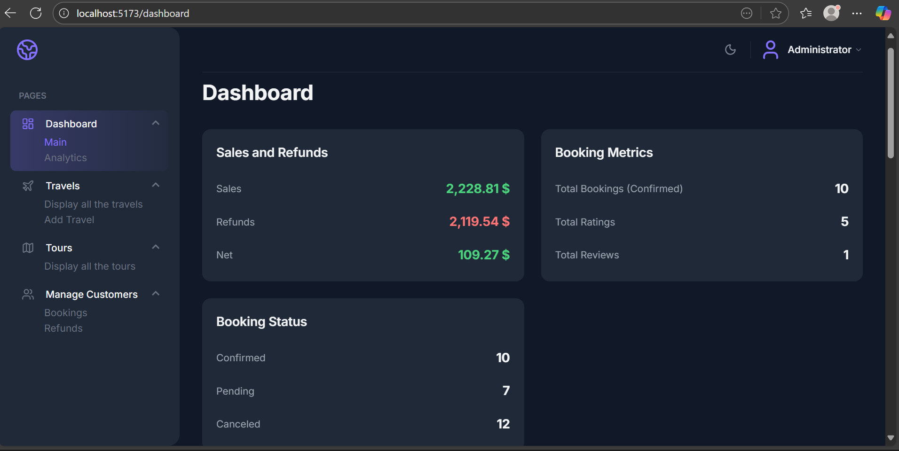
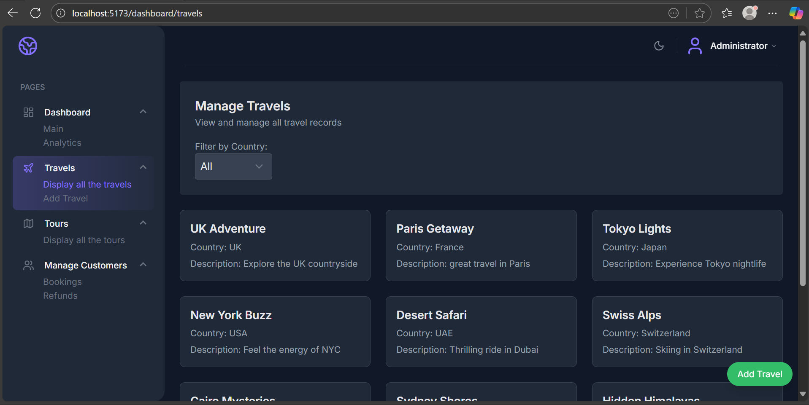
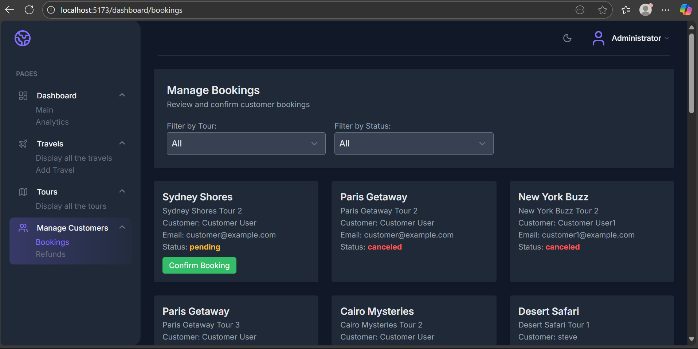

#  Travel Agency Management System

A full-stack travel agency management system built with **Laravel (API backend)** and **React (admin dashboard)**.  
This system allows travel agencies to manage travels, tours, and bookings, with authentication and analytics.

---

# Features

## Authentication
- User signup, login, and logout (Laravel Sanctum)  
- Role-based access control (Admin vs Customer)  

## Admin Dashboard (React)
- Travel management: create, view, edit, delete travels  
- Tour management: create, view, edit, delete tours  
- Booking management: view and confirm customer bookings  
- Refund management: view, update, and track refunds  
- Dashboard overview: summary of key metrics  
- Analytics:  
  - Top countries  
  - Top customers  
  - Refund reasons  
  - Sales summary  
- Notifications: real-time alerts using React Toastify  
- Icons & UI: clean interface using Lucide-react  

## Customer API Features
- Browse travels and tours (`/travels`, `/tours`)  
- Book tours and cancel bookings  
- Request refunds for bookings  
- Rate tours  

## Email & Notifications
- Email notifications for bookings, cancellations, and refunds

---

#  Tech Stack

##  Backend (Laravel)
- Laravel 11
- MySQL 
- Sanctum (for API authentication)
- Mailtrap for email notifications
- Eloquent ORM

##  Frontend (React)
- React 
- React Router DOM
- Axios (for API calls)
- React Toastify (notifications)
- Lucide-react (icons)
- TailwindCSS 

---

# Installation

## Clone the repository

```bash
git clone https://github.com/karamlk/travel-agency.git
cd travel-agency
```

## Backend setup (Laravel API)

### 1. Install Dependencies

```bash
composer install
```

### 2. Copy the example environment file 

```bash
cp .env.example .env
```

Then edit `.env` and configure your database:

```env
DB_CONNECTION=mysql
DB_HOST=127.0.0.1
DB_PORT=3306
DB_DATABASE=your_database
DB_USERNAME=your_username
DB_PASSWORD=your_password
```

### 3. Generate application key

```bash
php artisan key:generate
```

### 4. Run migrations with seeders:

```bash
php artisan migrate --seed
```

### 5. Serve Locally

```bash
php artisan serve
```

## Frontend setup (React Admin Dashboard)

### 1. Install Dependencies
```bash
npm install
```

### 2. Run 
```bash
npm run dev
```

- **Backend API:** http://localhost:8000  
- **Frontend Dashboard:** http://localhost:5173  

Login using the default admin credentials from the seeder (see `DatabaseSeeder.php`).

---

# Preview

### Login Page


### Dashboard Overview


### Travels Management


### Bookings Management


---

## 📝 API Documentation

All API endpoints with examples are included in the Postman collection.  

You can import it directly in Postman:

1. Open Postman.
2. Click **Import** → **File** → Select `backend/postman/Travel-Agency.postman_collection.json`.
3. Start testing the endpoints.

The collection file is located in the repository at: `backend/postman/Travel-Agency.postman_collection.json`
