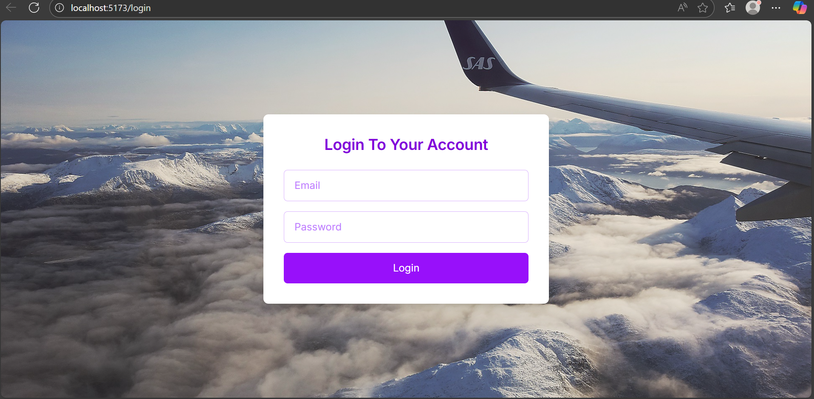
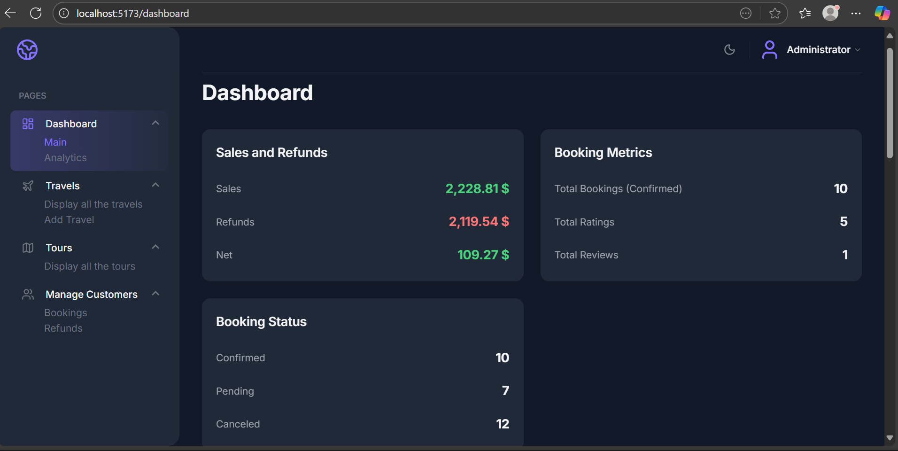
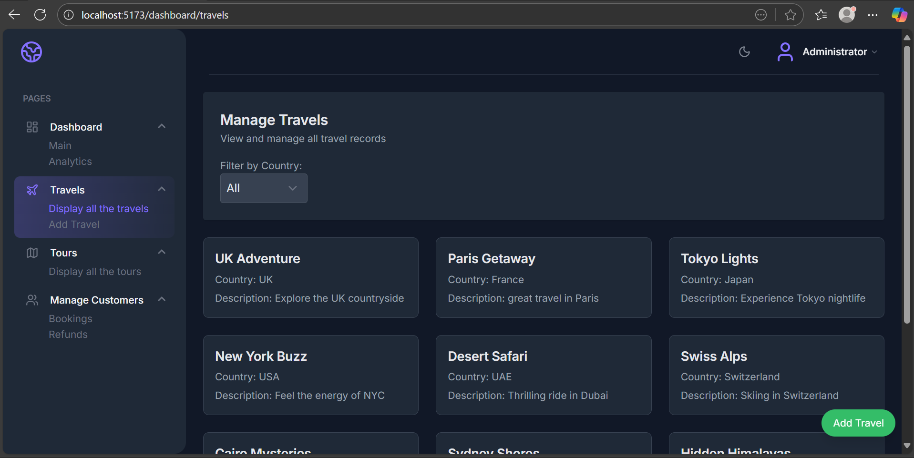
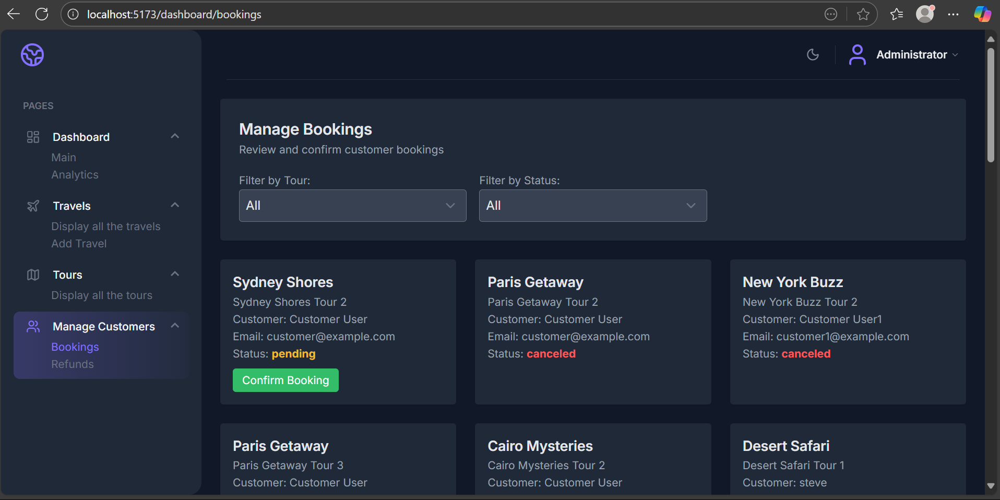

# Travel Agency Management System

<p align="center">
  <b>Full-stack travel agency platform — Laravel REST API backend with React admin dashboard</b>
</p>

<p align="center">
  
  
  
  
  
  
</p>

---

## Overview

A full-stack travel agency management system built with Laravel (API backend) and React (admin dashboard). Allows travel agencies to manage travels, tours, and bookings with role-based access control, analytics, and email notifications.

---

## Architecture

**Backend:** RESTful API with role-based access (Admin/Customer) using Laravel Sanctum. UUID-based resource identification for all entities prevents sequential ID enumeration.

**Frontend:** React admin dashboard with Context API state management, axios interceptors for token handling, and protected routes. Real-time toast notifications via React Toastify.

---

## Features

### Admin Dashboard
- Travel and tour management (create, view, edit, delete)
- Booking management — view and confirm customer bookings
- Refund management — view, update, and track refund requests
- Analytics — top countries, top customers, refund reasons, sales summary
- Dashboard overview with key metrics

### Customer API
- Browse travels and tours
- Book and cancel tours
- Request refunds
- Rate tours

### General
- Role-based access control (Admin vs Customer)
- Email notifications for bookings, cancellations, and refunds via Mailtrap

---

## Tech Stack

| Layer | Technology |
|---|---|
| Backend | Laravel 11 |
| Database | MySQL, Eloquent ORM |
| Auth | Laravel Sanctum |
| Email | Mailtrap |
| Frontend | React, React Router DOM |
| Styling | TailwindCSS |
| HTTP | Axios |
| Notifications | React Toastify |
| Icons | Lucide-react |
| API Testing | Postman |

---

## Installation

### 1. Clone

```bash
git clone https://github.com/karamlk/travel-agency.git
cd travel-agency
```

### Backend Setup

```bash
composer install
cp .env.example .env
```

Edit `.env` with your database credentials:

```env
DB_CONNECTION=mysql
DB_HOST=127.0.0.1
DB_PORT=3306
DB_DATABASE=your_database
DB_USERNAME=your_username
DB_PASSWORD=your_password
```

```bash
php artisan key:generate
php artisan migrate --seed
php artisan serve
```

### Frontend Setup

```bash
npm install
npm run dev
```

- Backend API: `http://localhost:8000`
- Frontend Dashboard: `http://localhost:5173`

Login using the default admin credentials from the seeder (see `DatabaseSeeder.php`).

---

## Preview

### Login Page


### Dashboard Overview


### Travels Management


### Bookings Management


---

## API Documentation

Import the Postman collection included in the repository:

`backend/postman/Travel-Agency.postman_collection.json`

All protected endpoints require:

```
Authorization: Bearer {token}
```
